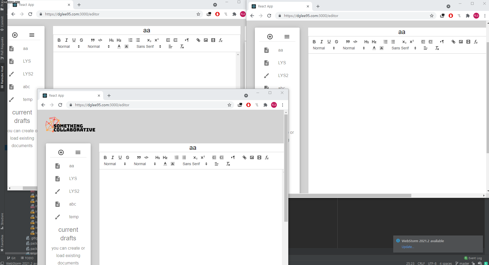

## Real-time collaborative documents 
Web application for editing texteditor and painting canvas in real-time collaboration.  
<br>
running demo server: https://dglee95.com:3000/
<br><br>

#### Environment  
***
```Nodejs``` ```React``` [```Socket.io```](https://socket.io/) [```Quill.js```](https://quilljs.com/)
<br><br><br><br>



***

## Details
<br>

React client and Express server are separated. <br>
Server does few things such as file managing, socket send/receive... <br>

To make socket communications distinguished by files, this server use ```Socket.join()``` to send sockets to paticipants of file.<br><br>
And Server manage files with ```filelist```. <br>
```filelist =[ {filename:"string", password:"string" , type: "string"} ]```<br><br>
And server manage those files distribution with ```userlist```<br>
```userlist = [ {filename: "string", userlist : (array) } ]```<br>

<br>

#### quill editor  
<br>

I used Quill for text editor. Quill supports [```delta```](https://quilljs.com/docs/delta/#delta) system that managing current editor's contents or users action.
<br>
Every editor actions like typing or resizing will send socket data to server about the action.
<br><br>
There is [react-quill](https://www.npmjs.com/package/react-quill) wrapper for react, but react-quill does not work properly with delta usage.
<br>
This program use ```useRef()``` hook to use [quill.js](https://quilljs.com/docs/quickstart/) that is third party library.
<br><br>
Text editor actions are more frequent than painting action. And it's not good to saving file contents every time when socket has arrived by typing.
<br>
So server has interval for periodical file saving. 

<br><br>


#### canvas
<br>

Painting canvas is made with ```html-canvas``` element. Canvas detects mouse event listener and draw dots on mouse drag.
<br>
Also, it's not efficient if client send sockets whithin every dots in single line stroke. So i use timeout method to send socket only when stroke is finally made.
<br><br>

When stroke made, current canvas image will encoded into .png format with base64 algorithm. Then send it to server.


